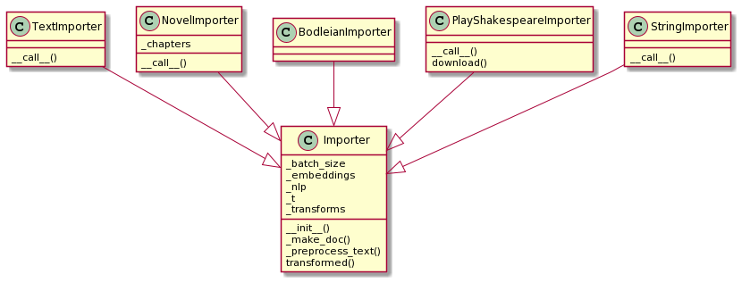

# Documents

## What is a Document?

A `Document` in Vectorian terminology is some text we can perform a
search on, e.g. book, a web page, or a Shakespeare play. For example,
the text of Shakespeare's *A Midsummer Night's Dream* and various metadata
(such as speakers, acts and scenes) about it could be regarded as one `Document`.

## Partitions and Spans

A problem in this terminology arises when we want to search a text on a
finer granularity level, e.g. when we aim to find all of the `Document`'s
sentences that match some query. For example, let us assume we want to
find all sentences in *A Midsummer Night's Dream* that contain a mention
of *Titania*. If we regard the whole text of *A Midsummer Night's Dream*
as one single `Document`, then the result of our search would be one single
hit, telling us that *A Midsummer Night's Dream* indeed contains one
occurence of *Titania*. This obviously is neither very useful nor not what
we set out to achieve.

A common approach to solving this problem is to change terminology
and split the `Document` into its sentences beforehand and then regard
those sentences as separate `Document`s. This approach can be confusing
though and has a number of technical and conceptual drawbacks.

The Vectorian takes a different approach and introduces a concept called
`Partition`, which is a combination of granularity control (the Vectorian
API calls this the `Partition`s level) and a sliding window specification.
Search operations do not operate on `Document`s, but instead on `Span`s that
are generated through applying a `Partition` on a `Document`. A `Span` is a
section of a Document, e.g. a single sentence or a specific sequence of tokens.

Here a three examples to illustrate the concepts - we assume that `doc` is
a `Document` and that `session` is a `Session`:

* `doc.spans(session.partition("document"))` produces one `Span` that represents
the document as a whole.
* `doc.spans(doc.partition("sentence"))` produces `Span`s such that each `Span`
is one sentence of the `Document`.
* `doc.spans(doc.partition("token", 5, 1))` produces `Span` by applying a sliding
window of size 5 to the tokens of the `Document`.

Which granularity levels (e.g. `"document"` or `"sentence"`) are available
depends on the `Importer` used (see next section). The default `Importer`s
support `"document"`, `"sentence"` and `"token"`.

## Importers

An `Importer` converts some input (e.g. plain text, a XML file, a Web URL, ...)
into a `Document`. It will perform tokenization, partition detection (e.g.
detection of sentence boundaries) and other related nlp tasks like lemmatization.
The `Importer` is also responsible for computing contextual embeddings.

Standard importers in the Vectorian include:
 
* `StringImporter`: turns a string into a `Document`
* `TextImporter`: turns a plain text file into a `Document`
* `NovelImporter`: imports a novel provided as a plain text file and keeps
additional data about the structure of the novel (e.g. chapter breaks) in
the resulting `Document`
* `PlayShakespeareImporter`: imports data from an XML file from
https://www.playshakespeare.com/ - the resulting `Document` knows
about speakers, acts and scenes for each line

Here is an example of using `StringImporter` to create a `Document` (you
need a spaCy `nlp` object that knows about the used language):

```
im = vectorian.importers.StringImporter(nlp)
doc = im("At the station is an art museum.")
```

`Importer`s - once created - act like factories for `Document`s, i.e. they can
be used to import multiple `Document`s.



## Persistence

Since the task of importing `Document`s can take considerable time - due to
various nlp pipeline steps and/or the computation of contextual embeddings -
it is useful to save and load imported `Document`s to and from disk by using
the `Document`'s `save` and the static `Document.load` methods. Note that these
methods do not take a filename, but rather a path, since a single `Document`
might consist of a number of files.

For saving and loading multiple `Document`'s, the `Corpus` class provides
some convenience functionality. First, construct a `Corpus` from your imported
`Document`'s. Then use `Corpus.save` (and later `Corpus.load`). As with
`Document`'s, these methods take a path (not a single filename). You can also
construct a corpus by incrementally saving corpus sub sets to a path and then
later on loading the whole `Corpus` in one go. Be aware that saving the
same set of `Documents` to the same path will currently cause duplication.
