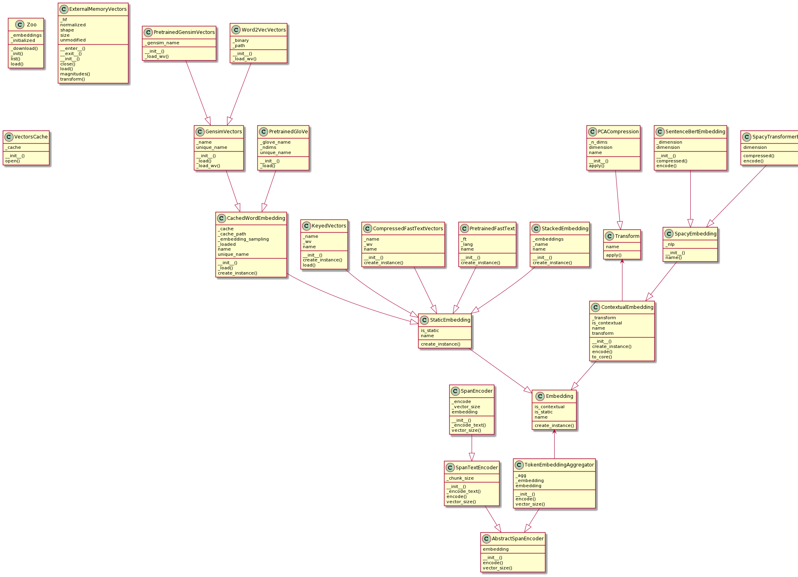

# Embeddings

## Token Embeddings vs. Document Embeddings

Note that the term *embedding* in this whole section always refers to
*token embeddings*. Document or sentence embeddings are not handled
via the `Embedding` class in the Vectorian. In order to use the latter,
use a `SpanEmbeddingSim` together with an `Index`, see the
sections on [Span Similarity](sim_span.md) and [Index](vec_index.md).

## Overview

Here is an overview of the different classes the API offers to load
and specify embeddings:



The following sections will explain the different kinds of classes
in detail.

## The Zoo

One of the easiest way to create an `Embedding` instance is to use the
`Zoo` class, which offers a small set of pretrained embeddings. Note that
Vectorian's model zoo is not aimed at offering a wide variety of currently
available embeddings and is more geared towards enabling quick and easy
experimentation within memory-constrained environments like Binder by
offering compressed versions of common standard embeddings.

To get a list of all available models, call

```
vectorian.embeddings.Zoo.list()
```

To load one embedding by its name, e.g. `fasttext-en-mini` use:

```
fasttext_mini = Zoo.load('fasttext-en-mini')
```

## Static Embeddings

Static Embeddings are embeddings that map one token string to one
embedding vector, independent of the token's occurence in a text.

All implementations derive from `StaticEmbedding`. The Vectorian supports
two kinds of flavors:

* keyed values (e.g. Word2vec, GloVe, Numberbatch)
* variants of fastText

Whereas the first variant is a simple key-value mapping, the structure
of fastText embeddings is more complex (and powerful) due to its n-gram
representation.

A second criterion when loading embeddings is whether you use a standard
pretrained embedding from an external provider (such as Facebook), or whether
you want to load embeddings you trained yourself. In the first case, the
Vectorian API takes care of downloading and caching the embedding data in
order to make it easy to use for new users.

### Keyed Values

Pretrained keyed values embeddings can be loaded either via Vectorian's
`Zoo` or via `PretrainedGensimVectors`, if the embedding is available
through `gensim-data` (see https://radimrehurek.com/gensim/downloader.html).
For GloVe, there is also the `PretrainedGloVe` class.

To load any other keyed values embedding, use  the `Word2VecVectors` class.
It takes a unique name and a path to a Word2vec formatted
file. Note that the contents of that file need not originate from Word2vec
and can contain any key-value-form embedding such as GloVe or Numberbatch.

### fastText

`PretrainedFastText` offers easy access to the official pretrained
fastText embbeddings offered by Facebook (see https://fasttext.cc/).
Simply specify the desired language code in the constructor and Vectorian
will download the necessary data. Note that these downloads are large and
will have memory requirements that are beyond what is provided by Binder.

`CompressedFastTextVectors` allows the loading of fastText data that has
been compressed via https://github.com/avidale/compress-fasttext. This
approach can reduce the memory requirements of fastText by several magnitudes
without a huge loss in quality.

## Sampling

A small but important topic with static topic is how embedding vectors are
to be chosen given various tokens that have been normalized to the same
base form. The approach taken is refered to as `sampling` in the Vectorian
and can be configured in various `Embedding` classes (see the `embedding_sampling`
argument in the `PretrainedGensimVectors` constructor for example).

Let us assume we have two tokens, "behold" and "Behold", that have both been
normalized to the same form "behold" through a lowercase-rule in the
`Session`'s `normalizers` settings (see [Session](session.md)). The
Vectorian offers two options how to deal with this:

* By default (using the "nearest" setting for `sampling`), the Vectorian will
choose the embedding of the nearest key, namely "behold", to look up the
vector for *both* tokens. Thus, both "behold" and "Behold" will get the
embedding vector that is given for "behold" in the embedding data.
* If specifying the "average" setting for `sampling`, the Vectorian will
look up the vectors for both "behold" and "Behold", then average these,
and then apply this averaged vector to both "behold" and "Behold".

Note that `sampling` will not be an issue if no token text normalization
is specified in the `Session` (i.e. if there are no unified tokens).

## Contextual Embeddings

### Difference from Static Embeddings

In contrast to static embeddings, contextual embeddings provide every token
instance in a text with a potentially different embedding vector. For example,
in "to be or not to be", the tokens "to" and "be" might get different embeddings
depending on their occurrence in the phrase. Thus, the bold "to" in "**to** be
or not to be" might be different from the bold "to" in "to be or not **to** be".

Static embeddings on the other hand would map "to" to exactly one (static) vector
all the time.

Contextual embeddings are often generated from network architectures such as ELMO,
BERT and various newer Transformer-based architectures.

### Usage in the Vectorian

To use contextual embeddings in the Vectorian, there are two options that provide
access to embeddings computed through a spaCy pipeline:

* `SpacyVectorEmbedding` uses the `vector` attribute in spaCy's `Token`class to
obtain embedding vectors.  This works well with dedicated packages auch as the
spaCy Sentence-BERT wrapper (see https://pypi.org/project/spacy-sentence-bert/).
* `SpacyTransformerEmbedding` obtains an embedding vector by access spaCy's
internal Transformer state (when using a Transformer model such as `en_core_web_trf`).

The second option is highly experimental and has a number of shortcomings (for
example, it is debatable if the embeddings acquired in this way are even suitable
as contextual embeddings since there is no control over the Transformer layers
which contribute to them). In general, the first option is to be preferred.

### Compression

It can be useful to compress contextual embeddings, since they can take up
a large amount of disk space (this can also impact search performance). Note
that compression is always a tradeoff between size and quality.

To obtain a PCA-compressed version of a contextual embedding, use the
`compressed` method inside the embedding's class. The Vectorian will then
automatically take care of compressing queries that run on those embeddings
in the correct way.

## Stacking Embeddings

A common technique to combine the benefits of different existing embeddings
into one new embedding is to stack them (i.e. appending their vectors).

In the Vectorian, this can be achieved by using the `StackedEmbedding` class
and providing the embeddings you want to stack.

At the time of this writing, this is only supported for static embeddings.
