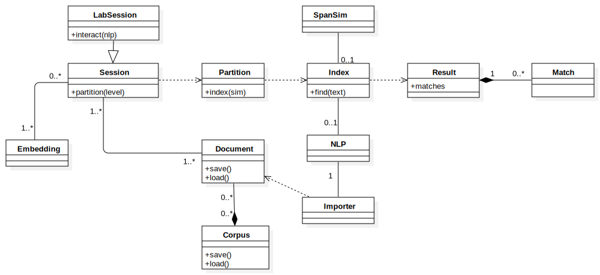
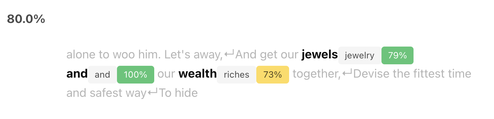

# Introduction

## Overview

The following (simplified) diagram shows an overview of the most important
classes and concepts of the Vectorian that you need to understand in order
to perform searches over collections of texts. We will go through individual
concepts in more detail later, but let us first get an understanding of how
different concepts relate.



In most abstract terms, to perform a search in the Vectorian you need to (refer
to the diagram above):

1. create a `Session` from `Embedding`s and `Document`s
2. create an `Index` from the `Session` through specifying a `Partition`
3. perform a search on the `Index` to get `Result`s and `Match`es

## Creating a `Session`

* create one or multiple `Embedding`s you want to work with. This boils down
to choosing which embedding(s) you want to base your token similarity
computations on. See [Embeddings](../embeddings) for more details.
* import (or load) one or multiple `Document`s that contain the text you
want to search over. `Document`s in the Vectorian are created using different
kinds of `Importer`s (these perform parsing tasks using a spaCy `NLP` class).
See [Documents](../documents) for more details.
* create a `Session` that bundles `Embedding`s and `Document`s in a way
that allows searches. See [Sessions](../sessions) for more details.

## Creating an `Index`

* from your `Session`, create a `Partition` - which specifies how `Document`s should be split into searchable units,
e.g. sentences. See [Documents](../documents) for more details.
* create a `SpanSim` that models the approach to compare document spans.
See [Span Similarity](../sim_span) for more details.
* from `Partition` and `SpanSim`, create an `Index` - which specifies the strategy,
i.e. algorithm, we employ for searching. See [Index](../vec_index) for more details.
* perform a search on that `Index` (using a query text)
* retrieve the `Result` and the `Match`es for that search

## Code Example

We now present a series of concrete code examples that illustrate the steps
described above.

Prepare by importing the `vectorian` module:

```
import vectorian
```

Now create an `Embedding`. We choose the 50-dimensional
variant of the pretrained GloVe 6B (see https://nlp.stanford.edu/projects/glove/):

```
glove = vectorian.embeddings.PretrainedGloVe('6B', ndims=50)
```

To turn an English text string into a `Document`, we first need an English
text parser. From this, we can create a `StringImporter`:

```
import spacy
nlp = spacy.load("en_core_web_sm")

im = vectorian.importers.StringImporter(nlp)
```

We can now create a `Document` from a string:

```
doc = im("""
He'll go along o'er the wide world with me;
Leave me alone to woo him. Let's away,
And get our jewels and our wealth together,
Devise the fittest time and safest way
To hide us from pursuit that will be made
After my flight. Now go we in content
To liberty and not to banishment.
""")  # Celia in "As You Like It"
```

The next piece of code creates a `LabSession` that brings together
the `Document`s we want to search over (`doc` in our case) and the
embeddings we want to employ.
 
`vectorian.session.LabSession` which is a special
kind of `Session` suited for running inside Jupyter. If not
running inside Jupyter, you might want to use
`vectorian.session.Session`.`

```
session = vectorian.session.LabSession(
    [doc],
    embeddings=[glove],
    normalizers="default")
```

Now we create a `SpanFlowSim`, which
is a special form of `SpanSim` that allows us to
specify the Waterman-Smith-Beyer alignment algorithm.
Note that we base this alignment on a concept of token similarity
that is computed through the the cosine similarity over the GloVe
embedding we specified earlier.

```
token_similarity = vectorian.similarity.TokenSim(
    glove,
    vectorian.similarity.CosineSimilarity())

span_similarity = vectorian.similarity.SpanFlowSim(
    token_sim=token_similarity,
    flow_strategy=vectorian.alignment.LocalAlignment(
        gap=vectorian.alignment.smooth_gap_cost(5)))
```

By creating `Partition` on a "sentence" level we instruct the
Vectorian to split `Document`s into sentences and search over
each of these.

```
partition = session.partition("sentence")
```

From that sentence partition of the session's document corpus,
we now create an `Index` that is based on the model of span and
token similarity we created earlier through `span_similarity`.

```
index = partition.index(span_similarity, nlp)
```

We are now ready to submit a query. Let us look for one occurence
of "jewelry and riches":

```
result = index.find("jewelry and riches", n=1)
result
```

If you are inside Jupyter, you will see the following result:



If not in Jupyter, you can get a JSON summary of the same result data by calling:

```
result.matches[0].to_json()
```

This gives:

```
{'slice': 2,
 'location': {'start': 16, 'end': 27},
 'score': 0.8001667857170105,
 'metric': 'glove-6B-50-cosine',
 'regions': [{'s': "alone to woo him. Let's away,\nAnd get our ",
   'gap_penalty': 0.0},
  {'s': 'jewels',
   'pos_s': 'NOUN',
   'edges': [{'t': {'text': 'jewelry', 'index': 0, 'pos': 'NOUN'},
     'flow': 1.0,
     'distance': 0.20577645301818848,
     'metric': 'glove-6B-50-cosine'}]},
  {'s': 'and',
   'pos_s': 'CCONJ',
   'edges': [{'t': {'text': 'and', 'index': 1, 'pos': 'CCONJ'},
     'flow': 1.0,
     'distance': 0.0,
     'metric': 'glove-6B-50-cosine'}]},
  {'s': 'our ', 'gap_penalty': 0.12944944202899933},
  {'s': 'wealth',
   'pos_s': 'NOUN',
   'edges': [{'t': {'text': 'riches', 'index': 2, 'pos': 'NOUN'},
     'flow': 1.0,
     'distance': 0.26427364349365234,
     'metric': 'glove-6B-50-cosine'}]},
  {'s': 'together,\nDevise the fittest time and safest way\nTo hide ',
   'gap_penalty': 0.0}],
 'omitted': [],
 'level': 'word'}
```

## Interactive Mode

If calling the Python API seems too tedious and you just want to explore the
options the Vectorian offers, the Vectorian offers an interactive GUI when run
inside Jupyter. This GUI allows to configure a large part of what can be achieved
through the Python API.

It can therefore serve as a starting point for exploring available options and
getting a better grasp of how different concepts relate to each other.

If `session` is a `LabSession` and `nlp` is a spaCy instance, simply call

```
session.interact(nlp)
```

inside Jupyter. This will create an interactive search widget that allows
you to perform searches.
