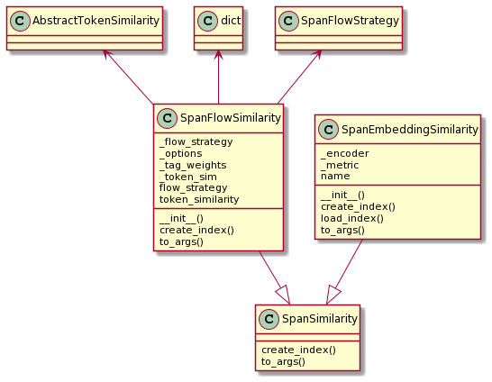
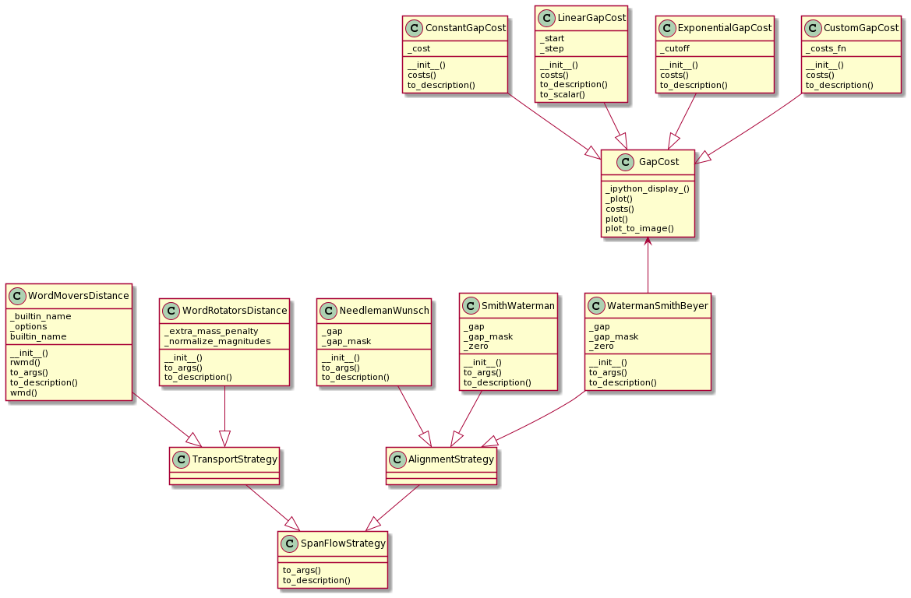

# Span Similarity

## SpanSim

Classes that derive from `SpanSim` model strategies to compare spans
of tokens, e.g. sentences. In contrast to comparing pairs of single tokens -
a concept that is called `EmbeddingTokenSim` in the Vectorian API -
`SpanSim` describes how to compute a similarity score between
two spans (i.e. sequences) of tokens, e.g. between to sentences.

There are two kind of `SpanSim` strategies the Vectorian supports, and
they are handled in two separate classes:

* `TE_SpanSim` models span flows (e.g. alignments and WMD)
* `SE_SpanSim` models span embeddings



The term "span flows" encompasses anything that produces a flow or mapping
between pairs of spans on a token level. On the one hand this can mean classical
alignments - e.g. Needleman-Wunsch or Smith-Waterman. On the other hand,
"flows" also include network-based approaches such as Word Mover's Distance.
The exact kind of strategy is specified using a
[`Optimizer`](#Optimizer) in the `TE_SpanSim` constructor.

The term "span embeddings" is a generalization of what is usually called
"document embeddings" or "sentence embeddings". With this strategy we
compute one embedding for a span of tokens. We do not specify an explicit
strategy for dealing with individual tokens. Instead we provide an encoder
that takes a span of tokens and outputs an embedding. To allow various kinds
of approaches (such as building span embeddings from token embeddings) the
actual encoder is wrapped inside other classes such as `TextEmbedding` and
`SpanEncoder` (more on this later).

Here is an example of setting up a Waterman-Smith-Beyer alignment that uses
cosine similarity over a pretrained GloVe embedding of dimension 50:

```
vectorian.metrics.TE_SpanSim(
    token_sim=vectorian.metrics(
        vectorian.embeddings.PretrainedGloVe('6B', ndims=50),
        vectorian.sim.vector.CosineSim()
    ),
    optimizer=vectorian.alignment.WatermanSmithBeyer(
        gap=vectorian.alignment.ExponentialGapCost(cutoff=5),
        zero=0.25))
```

## Optimizer

`Optimizer` models a strategy to compute a network flow on the bipartite
graph that models a pair of token spans (with tokens as nodes and each part of
the graph modelling one span). Specific strategies to do this include classical
alignments (e.g. Needleman-Wunsch) and variants of the Word Mover's Distance.

The following diagram shows the current implementations for `Optimizer`
available in the Vectorian.


