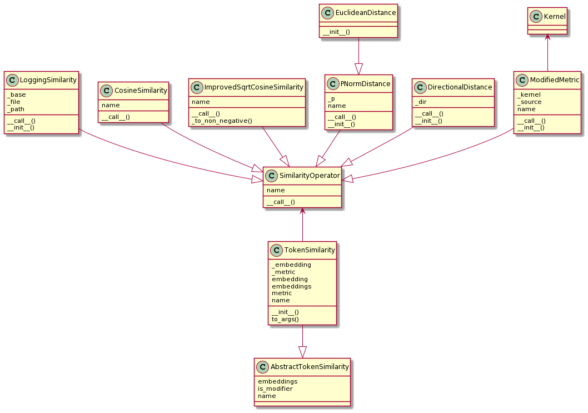
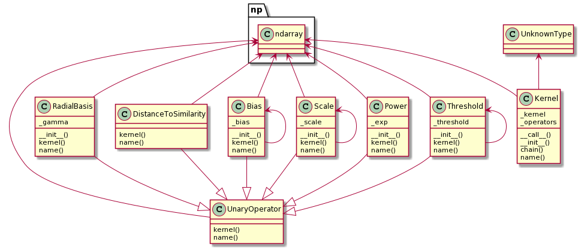
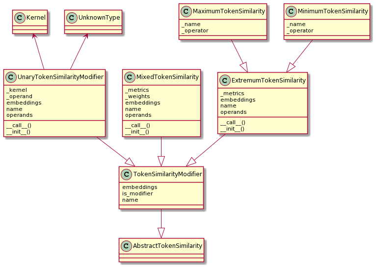

# Token Similarity

## TokenSimilarity

`vectorian.sim.token.TokenSimilarity` describes a strategy to compute a similarity
score from embeddings. It consists of two things:

* a specific embedding which serves as the source of vectors (e.g. fastText)
* a strategy to compute a scalar similarity value from two vectors

The first item is modelled by `vectorian.embedding.Embedding` in the Vectorian, the
latter by `vectorian.sim.vector.VectorSimilarity`.



## VectorSimilarity

`vectorian.sim.vector.VectorSimilarity` is a strategy that describes how to
compute a scalar similarity value from two given embedding vectors. The resulting
value is expected to lie between 0 (which implies minimum similarity) and 1 (which
implies maximum similarity). Negative values will be clipped to 0 later in the
pipeline.

An obvious choice for `VectorSimilarity` is `vectorian.sim.token.CosineSimilarity`,
which computes the cosine of the angle between two embedding vectors.

Other `VectorSimilarity` implementations based on other metrics are possible. It is
also possible to compute distances and later convert them to similarities (see
example further below).

The following diagram shows which `VectorSimilarity`s are currently implemented
in the Vectorian.


## Modifiers on VectorSimilarity

Using `vectorian.sim.token.ModifiedVectorSimilarity` and one or more
`vectorian.sim.kernel.UnaryOperator`s it is possible to perform additional
operations on a `VectorSimilarity`.

Note that this kind of operations are always based eventually on *one* single
embedding, since all such computations boil down to one root `VectorSimilarity`,
which usually operates on a single embedding.

For example the following code models a similarity based on the embedding stored
in `fastText`, where similarity between two vectors **u** and **v** is calculated
as `cos(phi) - 0.2`, if `phi` is the angle between **u** and **v**.

```
vectorian.sim.token.TokenSimilarity(
    fastText,
    vectorian.sim.vector.ModifiedVectorSimilarity(
        vectorian.sim.vector.CosineSimilarity(),
        vectorian.sim.kernel.Bias(-0.2)
    ))
```

The currently available unary operators (like e.g. `Bias`) that can be used
with `ModifiedVectorSimilarity` are shown in the following diagram:



## Modifiers on TokenSimilarity

The Vectorian also allows you to build completely new `TokenSimilarity`
strategies that are capable of combining different `TokenSimilarity` instances
that employ different embeddings.

One such example is `vectorian.sim.modifier.MixedTokenSimilarity`, which takes a
number of `TokenSimilarity` instances and combines them in a weighted sum.

Here is an example that combines two different `TokenSimilarity` instances to
build a new mixed `TokenSimilarity`:

```
vectorian.sim.modifier.MixedTokenSimilarity(
	[
        vectorian.sim.token.TokenSimilarity(
            fastText,
            vectorian.sim.vector.CosineSimilarity(),
        ),
        vectorian.sim.token.TokenSimilarity(
            glove,
            vectorian.sim.vector.ModifiedVectorSimilarity(
                vectorian.sim.vector.CosineSimilarity(),
                vectorian.sim.kernel.Bias(-0.2)
            )),
    ],
    weights=[0.3, 0.7])
```

Other combinators are possible. For example, `MaximumTokenSimilarity` takes the
highest similarity of a number of given `TokenSimilarity`s for each token.
Accordingly, `MinimumTokenSimilarity` takes the lowest similarity.

The following diagram shows all such multi-embedding combinators which are
currently implemented:



## Distances and Similarities

Here is an example of using a Euclidean distance as a `VectorSimilarity`:

```
vectorian.metrics.ModifiedVectorSimilarity(
    vectorian.sim.token.PNormDistance(p=2),
    vectorian.sim.kernel.RadialBasis(gamma=2.5),
    vectorian.sim.kernel.DistanceToSimilarity()
)
```

Using `RadialBasis`, the distance `d` is first calibrated such that the range
[0, 1] contains a meaningful distance (with 1 being minimum similarity), then
`DistanceToSimilarity` is used to compute `1 - d`, i.e. to turn the distance
into a scalar similarity value.
